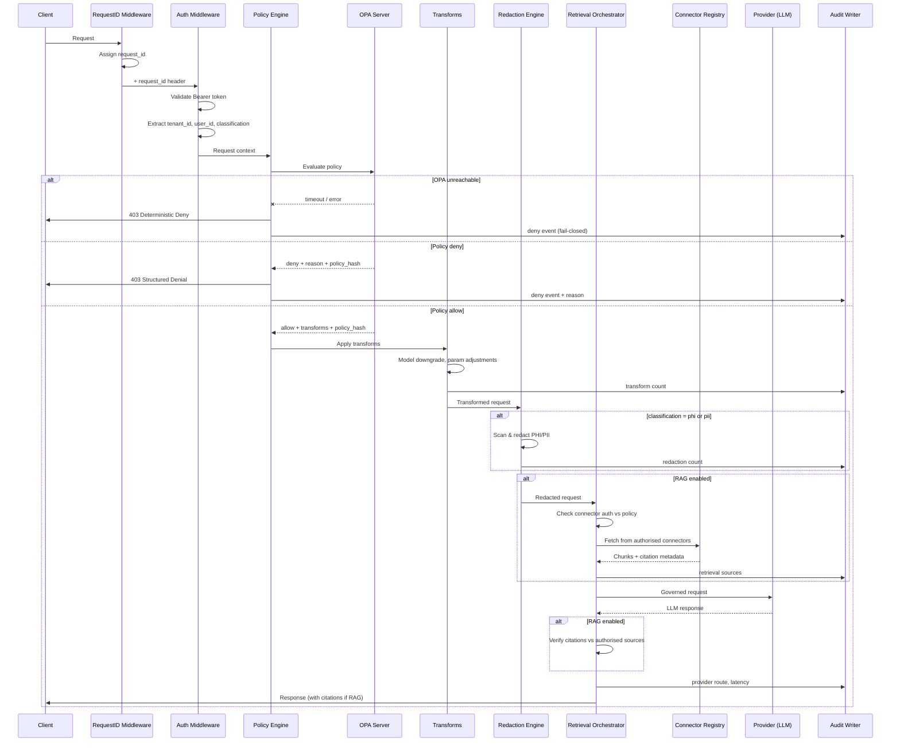
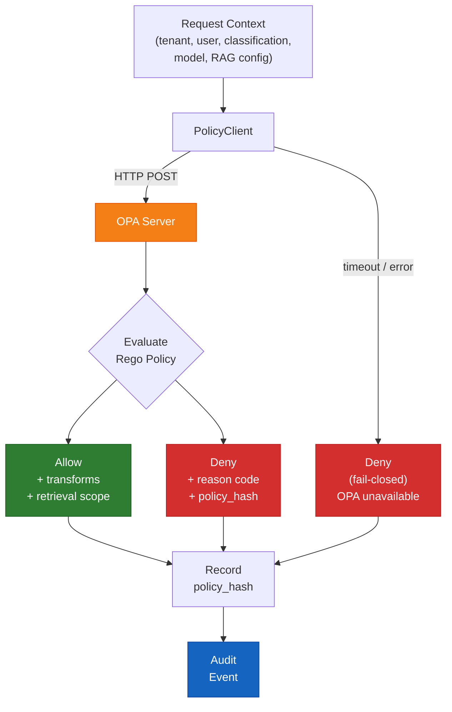
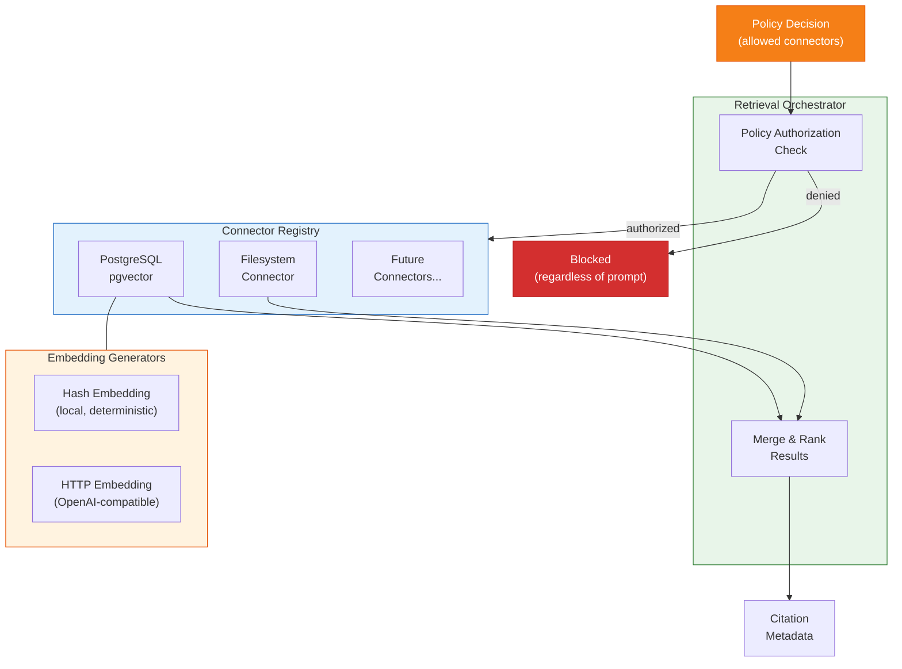
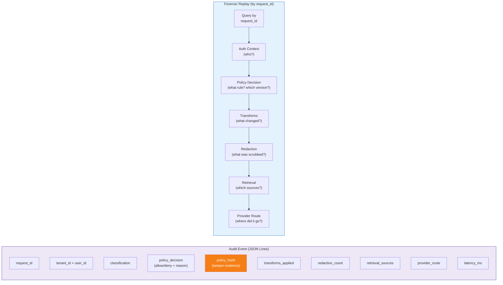
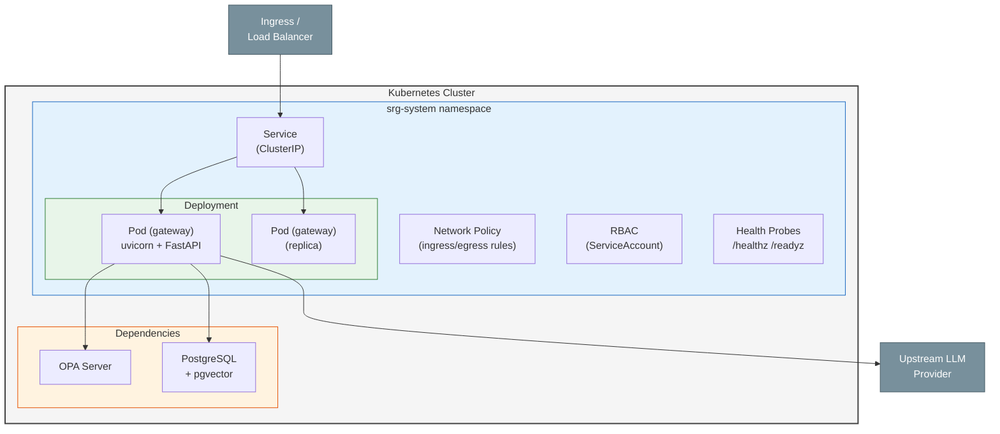
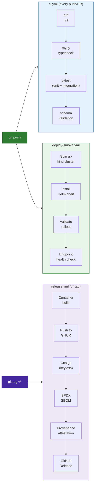

# Architecture

This document describes the internal architecture of Sovereign RAG Gateway — the design decisions, module responsibilities, data flow, and the reasoning behind key tradeoffs.

## Design Principles

1. **Governance in the hot path.** Policy evaluation happens before any data leaves the gateway boundary. This is not a sidecar or post-hoc logger — it is the enforcement point.

2. **Fail closed by default.** If the policy engine (OPA) is unreachable, the gateway denies the request. In regulated environments, silent degradation to permissive behaviour is a greater risk than explicit denial.

3. **Deterministic contracts.** Every API response follows a machine-readable schema. Error responses, policy denials, and audit events are structured — not free-text.

4. **Evidence over narrative.** Audit artifacts include policy version hashes, transform counts, and request-linked decision records. Claims are testable, not aspirational.

5. **Pluggable where it matters, opinionated where it counts.** Retrieval backends and embedding generators are pluggable. Failure behaviour and audit structure are not.

## Module Map

```
app/
├── api/                  # FastAPI route definitions
│   └── routes.py         # /v1/chat/completions, /v1/embeddings, /v1/models, health
│
├── middleware/            # Request-level concerns
│   ├── auth.py           # Bearer token validation, required header enforcement
│   └── request_id.py     # Unique request ID generation for tracing
│
├── policy/               # OPA integration layer
│   ├── client.py         # PolicyClient — HTTP client to OPA with fail-closed semantics
│   ├── models.py         # PolicyDecision schema (allow/deny + reason + metadata)
│   └── transforms.py     # Policy-driven request/response mutations
│
├── rag/                  # Retrieval Augmented Generation subsystem
│   ├── connectors/       # Pluggable retrieval backends
│   │   ├── filesystem.py # JSON Lines index on local filesystem
│   │   └── postgres.py   # PostgreSQL with pgvector for semantic retrieval
│   ├── embeddings.py     # Embedding generators (hash-based local, HTTP remote)
│   ├── registry.py       # Connector registration and lookup
│   ├── retrieval.py      # RetrievalOrchestrator — policy-aware retrieval coordination
│   └── types.py          # Shared RAG type definitions
│
├── redaction/            # Data protection
│   └── engine.py         # PHI/PII regex detection, classification-aware application
│
├── audit/                # Evidence production
│   └── writer.py         # AuditWriter — JSON Lines output with schema validation
│
├── services/             # Business logic orchestration
│   └── chat_service.py   # ChatService — full pipeline: auth→policy→retrieval→redact→egress
│
├── providers/            # Upstream LLM provider abstraction
│   ├── base.py           # ChatProvider interface
│   └── stub.py           # In-memory mock for testing
│
├── models/               # Shared Pydantic models
├── config/               # Settings management (Pydantic BaseSettings)
├── core/                 # Shared utilities and error types
└── main.py               # FastAPI application factory
```

## Request Lifecycle

A single request through the gateway follows this deterministic sequence:



### Lifecycle Stages Summary

```mermaid
flowchart LR
    A["1. Ingress\n(ID + Auth)"] --> B["2. Policy\n(OPA eval)"]
    B --> C["3. Transform\n(mutations)"]
    C --> D["4. Redaction\n(PHI/PII)"]
    D --> E["5. Retrieval\n(policy-scoped)"]
    E --> F["6. Egress\n(LLM call)"]
    F --> G["7. Citations\n(verify sources)"]
    G --> H["8. Audit\n(evidence)"]

    style A fill:#e3f2fd,stroke:#1565c0
    style B fill:#fff3e0,stroke:#e65100
    style C fill:#fff3e0,stroke:#e65100
    style D fill:#fce4ec,stroke:#c62828
    style E fill:#e8f5e9,stroke:#2e7d32
    style F fill:#78909c,color:#fff,stroke:#455a64
    style G fill:#e8f5e9,stroke:#2e7d32
    style H fill:#ede7f6,stroke:#4527a0
```



## Policy Engine Integration

The gateway integrates with Open Policy Agent (OPA) as the policy decision point.



**Why OPA:**
- Declarative policy language (Rego) enables version-controlled, reviewable policy definitions
- Decoupled evaluation — policies are authored, tested, and deployed independently from gateway code
- Policy bundles support progressive rollout and environment-specific configurations

**Fail-Closed Contract:**
The PolicyClient implements a strict fail-closed contract. If OPA returns an error, times out, or is unreachable, the gateway returns a deterministic deny response. This is not configurable — permissive fallback would undermine the governance guarantee.

**Observe vs Enforce:**
Two operational modes support progressive adoption:
- `observe`: policy is evaluated and the decision is logged, but requests are never blocked. Useful for policy validation before enforcement.
- `enforce`: policy decisions are binding. Deny decisions block the request.

## RAG Subsystem Design



### Connector Registry
Retrieval backends are registered through a connector registry pattern. Each connector implements a common interface for chunk retrieval, enabling backends to be swapped without changing orchestration logic.

**Current connectors:**
- `FilesystemConnector`: reads from a JSON Lines index. Deterministic, no external dependencies. Suitable for testing and small-scale deployments.
- `PostgresPgvectorConnector`: semantic retrieval using PostgreSQL with the pgvector extension. Supports both hash-based (local, deterministic) and HTTP-based (remote OpenAI-compatible) embedding generation.

### Embedding Strategy
Two embedding generators address different deployment constraints:
- `HashEmbeddingGenerator`: produces deterministic lexical-hash vectors locally. No network calls, fully reproducible. Baseline for testing and air-gapped environments.
- `HTTPOpenAIEmbeddingGenerator`: calls any OpenAI-compatible embedding endpoint. Used for production-quality semantic retrieval.

### Policy-Scoped Retrieval
The RetrievalOrchestrator enforces retrieval constraints from the policy decision. A tenant's policy might permit access to `filesystem` but deny `postgres`, or permit retrieval from specific document partitions. These constraints are enforced at the orchestrator level — prompt injection attempts to override source scope are ineffective because authorisation is decoupled from prompt content.

## Audit Trail Design

Audit events are append-only JSON Lines records. Each event is self-contained and linked to the originating request by `request_id`.



**Tamper evidence:** each audit event includes the `policy_hash` — a hash of the policy version that was evaluated. If a policy is later modified, the hash chain reveals that the currently deployed policy differs from the one that was active during the audited request.

**Forensic replay:** given a `request_id`, an investigator can reconstruct the complete execution path — auth context, policy evaluation result, transforms applied, redaction operations, retrieval sources accessed, and provider routing decision.

## Testing Strategy

The test suite is structured in three layers:

| Layer | Purpose | Count |
|---|---|---|
| Unit tests | Isolated module behaviour (middleware, connectors, redaction, embeddings) | 11 files |
| Integration tests | Cross-module flows (chat endpoint, RAG pipeline, policy modes, OpenAI SDK compatibility) | 11 files |
| Contract and benchmark tests | Schema validation, release notes, benchmark data integrity | 6 files |

All integration tests that depend on external services (PostgreSQL, OPA) use conditional execution — they run when the required service is available and are skipped otherwise.

## Deployment Model



### Container
- Base image: `python:3.12-slim`
- Runtime: uvicorn running from a built virtualenv at `/app/.venv/bin/uvicorn`
- No root process, minimal attack surface

### Kubernetes (Helm)
- Namespace-isolated deployment with RBAC
- Network policies restricting ingress/egress
- Liveness and readiness probes on `/healthz` and `/readyz`
- Values schema validation prevents misconfiguration
- Configurable resource limits and replica counts

### CI/CD Pipeline



Three GitHub Actions workflows:
1. **ci.yml**: lint (ruff), type check (mypy), test (pytest), schema validation on every push/PR
2. **deploy-smoke.yml**: spins up a kind cluster, installs the Helm chart, validates rollout and endpoint health
3. **release.yml**: triggered by `v*` tags — builds and pushes to GHCR, signs with cosign (keyless), generates SPDX SBOM, attaches provenance attestation, publishes release notes from CHANGELOG.md

## Key Tradeoffs

| Decision | Tradeoff | Reasoning |
|---|---|---|
| Fail-closed on OPA unavailability | Availability impact during policy outages | Explicit denial is safer than implicit permission in regulated workloads |
| Regex-first redaction | Lower accuracy than NER/ML approaches | Deterministic, no model dependency, measurable false-positive rate. ML upgrade path planned. |
| Synchronous policy evaluation | Adds latency to every request | Async/eventual consistency would break the "enforce before egress" guarantee |
| Single gateway binary | Not a microservice mesh | Reduces operational complexity. Policy, redaction, and audit are tightly coupled concerns that benefit from co-location. |
| OpenAI-compatible surface only | No native Anthropic/Google/Bedrock endpoints | Reduces scope. Most providers offer OpenAI-compatible modes. Provider-specific extensions add complexity without proportional governance value. |
