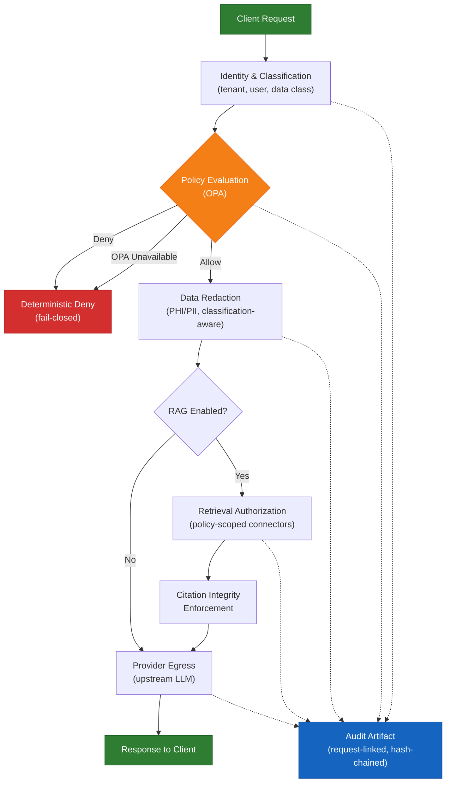
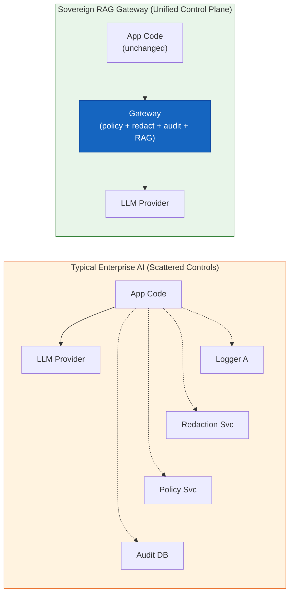
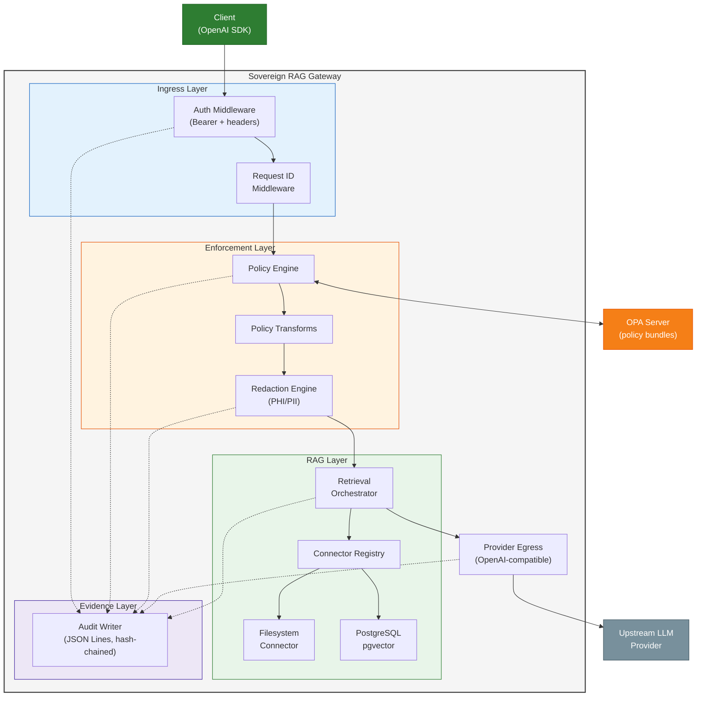
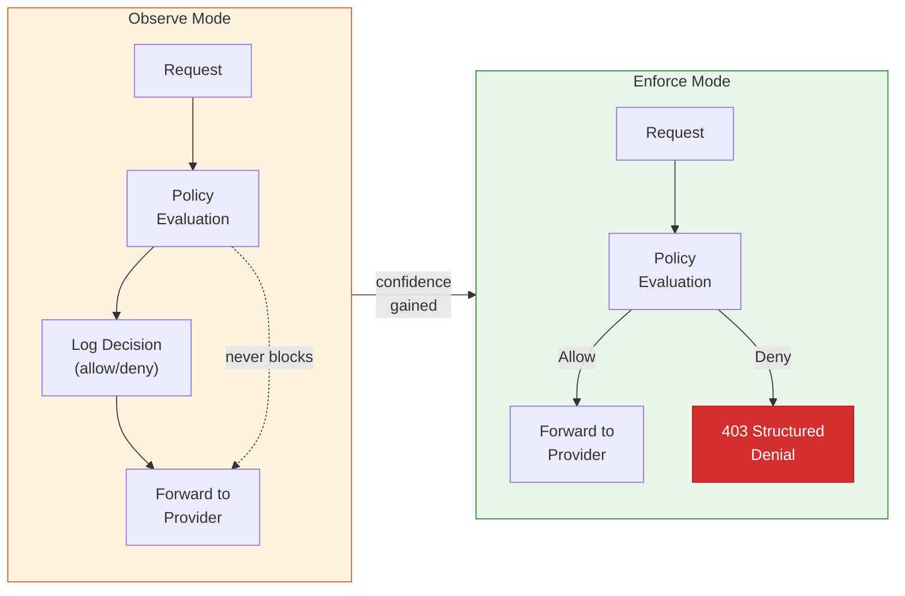
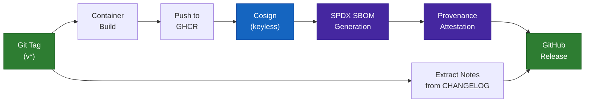

# Sovereign RAG Gateway

**A policy-first, OpenAI-compatible governance gateway for regulated AI workloads.**

Sovereign RAG Gateway enforces runtime governance — identity verification, policy evaluation, data redaction, and retrieval authorization — in the critical path of every LLM and RAG request, before traffic reaches upstream providers. It produces tamper-evident decision trails that enable forensic replay during incident response and regulatory audits.

Built for security engineering teams, platform teams, and SREs operating AI systems in healthcare, financial services, and other regulated domains where post-hoc controls and best-effort logging are insufficient.

## The Problem

Enterprise AI deployments in regulated industries face a structural gap: governance controls are typically bolted on after the fact — one service handles redaction, another handles policy, another handles routing, and audit logs are scattered across systems. During incidents, teams cannot prove whether controls were actually enforced at decision time.

This architecture fails under regulatory scrutiny because it cannot answer the fundamental question: *what exact policy version evaluated this request, what transformations were applied, and why was the decision allow or deny?*

## How It Works

Sovereign RAG Gateway moves governance into the hot path. Every request passes through a deterministic enforcement pipeline before any data leaves the boundary:



The gateway is intentionally opinionated about failure behaviour: if policy evaluation is unavailable, it defaults to **deterministic deny**. In regulated environments, silent fallback to permissive behaviour creates larger incident and audit risk than explicit denial.

### The Problem This Solves — Before vs After



## Core Capabilities

### In-Path Policy Enforcement
Every request is evaluated by OPA (Open Policy Agent) before retrieval or provider egress. Policy decisions are deterministic, machine-readable, and recorded with the policy version hash. Supports `enforce` mode (blocks requests) and `observe` mode (logs without blocking) for progressive rollout.

### Tamper-Evident Decision Lineage
Each request produces decision artifacts linked by request ID and policy hash. Auth context, policy evaluation, transform operations, and provider routing decisions are recorded in a structured audit trail that enables forensic reconstruction of any request's full execution path.

### Classification-Aware Data Redaction
PHI/PII detection and redaction applied based on the request's data classification header. Redaction events are counted, logged, and included in the audit artifact. The system makes no claim of perfect detection — false-positive and false-negative rates are explicitly measured and published.

### Policy-Scoped Retrieval (RAG)
Retrieval Augmented Generation with governance constraints: connector access is authorized per-tenant and per-policy, source partitions are enforced regardless of prompt content, and citations in responses must reference only authorized sources. Supports pluggable backends including filesystem indexes and PostgreSQL with pgvector.

### OpenAI API Compatibility
Drop-in compatible with OpenAI's chat completions, embeddings, and model listing endpoints. Application teams use standard OpenAI client SDKs without modification — governance is transparent at the transport layer.

### Multi-Provider Routing with Cost-Aware Fallback
Provider registry pattern with automatic failover on retryable errors (429, 502, 503). Cost-per-token selection enables budget-aware routing across multiple upstream LLM providers. Fallback chains are configurable per-tenant and recorded in audit events for forensic analysis.

### Prometheus Metrics and Grafana Dashboards
Native `/metrics` endpoint exposes request rates, latency percentiles, policy decisions, token throughput, provider cost, redaction counts, and fallback events. Pre-built Grafana dashboard with 10 panels across four operational domains: request overview, policy decisions, provider cost, and data protection.

### Production Kubernetes Deployment
Helm chart with secure defaults, RBAC, network policies, liveness/readiness probes, and values schema validation. Automated release pipeline with container signing (keyless cosign), SBOM generation (SPDX), and provenance attestation.

### GitOps and Secret Management
Argo CD ApplicationSet for declarative multi-environment promotion (dev, staging, prod). External Secrets Operator integration with AWS Secrets Manager for automated secret rotation. Rotation runbook with emergency revocation procedures.

## Architecture



## Tech Stack

| Layer | Technology |
|---|---|
| Language | Python 3.12+ |
| Framework | FastAPI 0.115+ (async, OpenAI-compatible) |
| Policy Engine | Open Policy Agent (OPA) 0.67+ |
| Vector Store | PostgreSQL 16+ with pgvector |
| Containerisation | Docker (Python 3.12-slim) |
| Orchestration | Kubernetes, Helm v3 |
| Observability | Prometheus metrics, Grafana dashboards, OpenTelemetry collector |
| CI/CD | GitHub Actions (test, deploy-smoke, release) |
| GitOps | Argo CD ApplicationSet, External Secrets Operator |
| Supply Chain | Cosign (keyless signing), SPDX SBOM, provenance attestation |
| Package Management | uv |
| Quality | pytest, ruff, mypy (strict mode) |

## Governance Modes

The gateway supports progressive adoption through two operational modes. This allows teams to validate policy behaviour in production traffic before enabling enforcement:



## Release and Supply Chain Pipeline

Every tagged release goes through a signed, auditable pipeline:



## Benchmark Methodology

The project follows a publish-methodology-not-just-scores approach to evaluation:

**Governance Yield vs Performance Overhead** — the primary benchmark track quantifies the tradeoff between governance effectiveness and runtime overhead across four conditions:

| Condition | Description |
|---|---|
| Baseline | Direct provider calls, no gateway |
| Observe | Gateway decisions logged, not enforced |
| Enforce | Policy evaluation + data redaction |
| Enforce + RAG | Policy + redaction + connector-scoped retrieval |

**Key Metrics and v0.2 Targets:**
| Metric | Target |
|---|---|
| Leakage rate (sensitive data reaching provider) | < 0.5% |
| Redaction false-positive rate | < 8% |
| Policy deny F1 score | >= 0.90 |
| Citation integrity (authorised sources only) | >= 99% |
| p95 latency overhead (chat) | < 250 ms |
| p95 latency overhead (RAG) | < 600 ms |

CI-enforced quality gates: citation presence rate >= 0.95, pgvector Recall@3 >= 0.80. All benchmark artifacts (raw CSV/JSON, provenance manifests, reproduction scripts) are published alongside summary reports.

Full methodology: [`docs/benchmarks/governance-yield-vs-performance-overhead.md`](docs/benchmarks/governance-yield-vs-performance-overhead.md)

## Competitive Landscape

Evaluated against 10 adjacent tools in the AI gateway and governance space:

| Category | Tools Evaluated |
|---|---|
| AI Gateway / Proxy | LiteLLM Proxy, Portkey, OpenRouter |
| API Gateway + AI | Kong AI Gateway, Gloo AI Gateway, Envoy AI Gateway |
| Cloud-Native AI Gateway | Cloudflare AI Gateway, Azure APIM GenAI Gateway |
| Guardrails / Safety | NVIDIA NeMo Guardrails, Guardrails AI |

**Differentiation wedge:** Sovereign RAG Gateway is the only tool in this landscape that combines fail-closed in-path policy enforcement, tamper-evident decision lineage, and policy-scoped RAG with citation integrity — all in a single, self-hosted Kubernetes-deployable control plane. Existing tools either focus on routing/cost (LiteLLM, Portkey), require platform lock-in (Azure, Cloudflare), or provide guardrails without centralized runtime enforcement and audit lineage (NeMo, Guardrails AI).

Full analysis with source references: [`docs/strategy/differentiation-strategy.md`](docs/strategy/differentiation-strategy.md)

## Project Metrics

| Metric | Value |
|---|---|
| Python source files | 76 |
| Test files | 30 |
| Test coverage scope | Unit, integration, contract, benchmark validation |
| CI pipelines | 3 (test, deploy-smoke on kind, signed release) |
| JSON Schema contracts | 3 (policy decision, audit event, citations) |
| Benchmark eval gates | 2 (citation integrity, pgvector ranking) |
| Prometheus metrics | 6 counters + 1 histogram |
| Grafana dashboard panels | 10 (request, policy, cost, data protection) |
| GitOps environments | 3 (dev, staging, prod via Argo CD) |
| Current version | 0.3.0-rc1 |

## Quick Start

### Prerequisites
- Python 3.12+
- [uv](https://github.com/astral-sh/uv) package manager
- Docker (for containerised deployment)
- kind (for local Kubernetes)

### Development
```bash
make dev            # Start dev server with hot reload
make test           # Run full test suite
make lint           # Ruff linting
make typecheck      # mypy strict type checking
```

### Kubernetes Deployment
```bash
make helm-lint      # Validate Helm chart
make helm-template  # Generate manifests
make demo-up        # Deploy to kind + smoke test
```

### API Usage
```bash
curl -s http://127.0.0.1:8000/v1/chat/completions \
  -H 'Authorization: Bearer dev-key' \
  -H 'x-srg-tenant-id: tenant-a' \
  -H 'x-srg-user-id: user-1' \
  -H 'x-srg-classification: phi' \
  -H 'content-type: application/json' \
  -d '{"model":"gpt-4o-mini","messages":[{"role":"user","content":"hello DOB 01/01/1990"}]}'
```

RAG-enabled request with citation tracking:
```bash
curl -s http://127.0.0.1:8000/v1/chat/completions \
  -H 'Authorization: Bearer dev-key' \
  -H 'x-srg-tenant-id: tenant-a' \
  -H 'x-srg-user-id: user-1' \
  -H 'x-srg-classification: phi' \
  -H 'content-type: application/json' \
  -d '{
    "model":"gpt-4o-mini",
    "messages":[{"role":"user","content":"give triage policy summary"}],
    "rag":{"enabled":true,"connector":"filesystem","top_k":2}
  }'
```

## Documentation

| Document | Description |
|---|---|
| [`docs/strategy/differentiation-strategy.md`](docs/strategy/differentiation-strategy.md) | Competitive analysis and positioning |
| [`docs/strategy/why-this-exists-security-sre.md`](docs/strategy/why-this-exists-security-sre.md) | Security and SRE problem narrative |
| [`docs/strategy/killer-demo-stories.md`](docs/strategy/killer-demo-stories.md) | 5 measurable demo scenarios |
| [`docs/benchmarks/governance-yield-vs-performance-overhead.md`](docs/benchmarks/governance-yield-vs-performance-overhead.md) | Full benchmark methodology |
| [`docs/operations/helm-kind-runbook.md`](docs/operations/helm-kind-runbook.md) | Local Kubernetes deployment guide |
| [`docs/operations/secrets-rotation-runbook.md`](docs/operations/secrets-rotation-runbook.md) | Secret rotation and emergency revocation |
| [`docs/contracts/v1/`](docs/contracts/v1/) | JSON Schema contracts (policy, audit, citations) |
| [`docs/releases/v0.2.0.md`](docs/releases/v0.2.0.md) | Current release notes |

## Honest Gap Assessment

This project makes narrow, testable claims — not aspirational ones:

- **No claim of perfect PHI detection.** Regex-first redaction has measurable false positives and false negatives. Rates are benchmarked and published.
- **No claim of full provider API parity.** OpenAI compatibility covers core endpoints (chat, embeddings, models). Provider-specific extensions are out of scope in early versions.
- **No claim that this replaces broader controls.** Gateway enforcement does not substitute for secure SDLC, IAM, or data governance programmes.
- **Policy quality depends on fixture coverage.** OPA policies can drift without strict test gates and review processes.

## Roadmap

- [x] Multi-provider routing with cost-aware fallback
- [x] Baseline Grafana dashboards for request/policy/cost telemetry
- [x] External secrets integration and rotation runbook
- [x] GitOps manifests (Argo CD) for declarative promotion
- [ ] Streaming support for chat completions
- [ ] Azure/Anthropic provider adapters
- [ ] S3 connector for document retrieval
- [ ] EKS reference deployment with validated guide

## Licence

See [LICENSE](LICENSE) for details.
