# Sovereign RAG Gateway

**A policy-first, OpenAI-compatible governance gateway for regulated AI workloads.**


Sovereign RAG Gateway enforces runtime governance — identity verification, policy evaluation, data redaction, and retrieval authorization — in the critical path of every LLM and RAG request, before traffic reaches upstream providers. It produces tamper-evident, hash-chained decision trails that enable forensic replay during incident response and regulatory audits.

Built for security engineering teams, platform teams, and SREs operating AI systems in healthcare, financial services, and other regulated domains where post-hoc controls are insufficient.

---

## The Problem

Enterprise AI deployments in regulated industries face a structural gap: governance controls are bolted on after the fact — one service handles redaction, another handles policy, another handles routing, and audit logs are scattered across systems with no causal linkage. During incidents, no single system can reconstruct the complete decision path for a given request.

In healthcare (HIPAA), financial services (FCA, PRA), and other regulated domains, auditors require demonstrable proof that controls were enforced at decision time — not aspirational documentation that controls exist somewhere in the architecture. The fundamental question is: *what exact policy version evaluated this request, what transformations were applied to the data, and can you cryptographically prove it?*

Post-hoc logging cannot answer this question. If redaction runs in a separate service with eventual consistency, you cannot prove that PHI was scrubbed before it left the boundary. If policy evaluation is asynchronous, you cannot prove the request was governed before reaching the provider. Observability without enforcement is monitoring, not governance.

## How It Works

Sovereign RAG Gateway moves governance into the hot path. Every request passes through a deterministic enforcement pipeline before any data leaves the boundary:

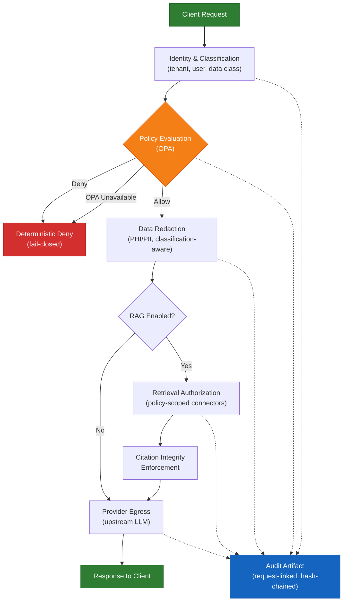

The gateway is intentionally opinionated about failure behaviour: if policy evaluation is unavailable, it defaults to **deterministic deny**. In regulated environments, silent fallback to permissive behaviour creates larger incident and audit risk than explicit denial.

### The Problem This Solves — Before vs After

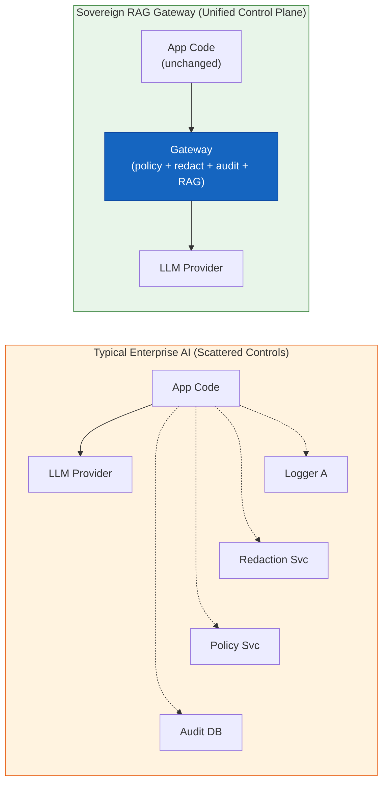

## Architecture

The gateway is structured as five cooperating layers. Each layer has a single responsibility, and data flows through them in a fixed, deterministic sequence:

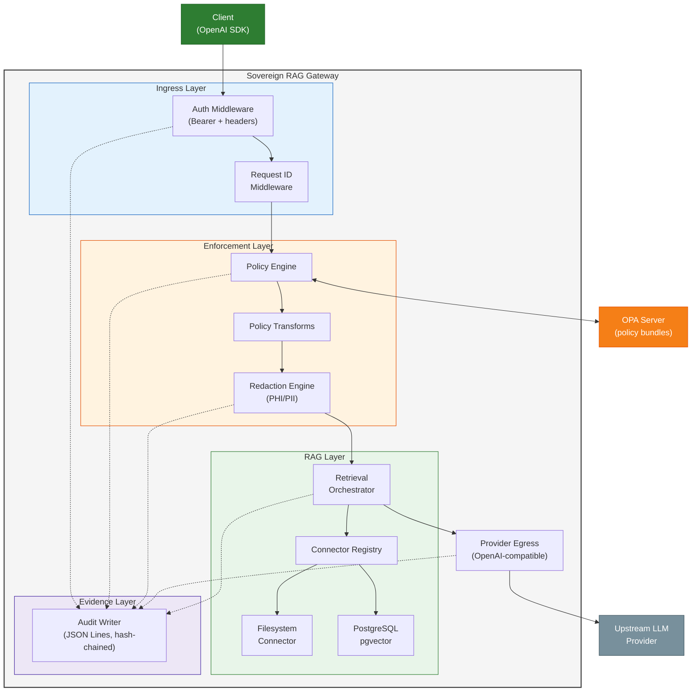

### Module Map

| Layer | Modules | Responsibility |
|---|---|---|
| Ingress | `middleware/auth.py`, `middleware/request_id.py` | Identity extraction, classification headers, request tracing |
| Enforcement | `policy/client.py`, `policy/transforms.py`, `redaction/engine.py` | OPA evaluation, fail-closed contract, PHI/PII scrubbing |
| Retrieval | `rag/retrieval.py`, `rag/registry.py`, `rag/connectors/` | Policy-scoped connector dispatch, citation integrity |
| Egress | `providers/registry.py`, `providers/http_openai.py` | Multi-provider routing, cost-aware fallback |
| Evidence | `audit/writer.py` | Hash-chained JSON Lines, schema-validated audit events |

Full architecture reference: [`ARCHITECTURE.md`](ARCHITECTURE.md)

## Core Capabilities

### In-Path Policy Enforcement

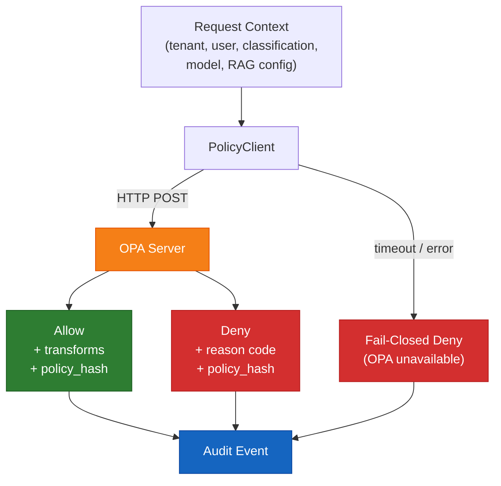

Every request is evaluated by OPA before retrieval or provider egress. Policy decisions are deterministic, machine-readable, and recorded with the policy version hash. Supports `enforce` mode (blocks requests) and `observe` mode (logs without blocking) for progressive rollout.

### Data Protection Flow

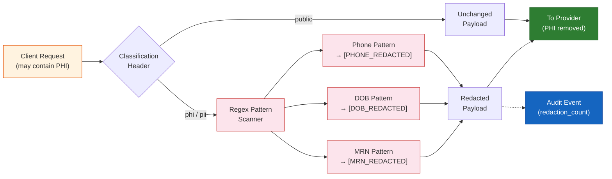

Classification-aware redaction activates only when the request's data classification header indicates PHI or PII. Redaction events are counted, logged, and included in the audit artifact. The system makes no claim of perfect detection — false-positive and false-negative rates are explicitly measured and published.

### Policy-Scoped Retrieval (RAG)

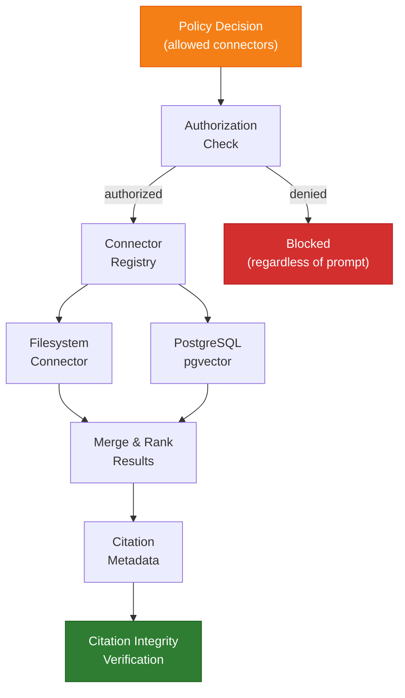

Connector access is authorized per-tenant and per-policy. Source partitions are enforced regardless of prompt content — prompt injection attempts to override source scope are ineffective because authorization is decoupled from prompt content. Citations in responses must reference only authorized sources.

### Tamper-Evident Audit Trail

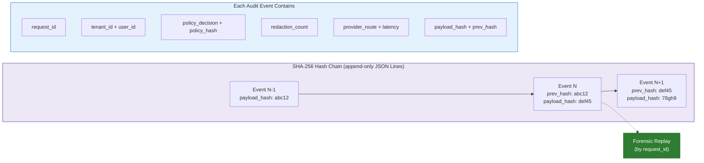

Each audit event is hash-chained using SHA-256 — every event records the `payload_hash` of the previous event as its `prev_hash`, creating a tamper-evident chain. Given a `request_id`, an investigator can reconstruct the complete execution path: auth context, policy evaluation, transforms applied, redaction operations, retrieval sources, and provider routing decision.

### Multi-Provider Routing with Cost-Aware Fallback

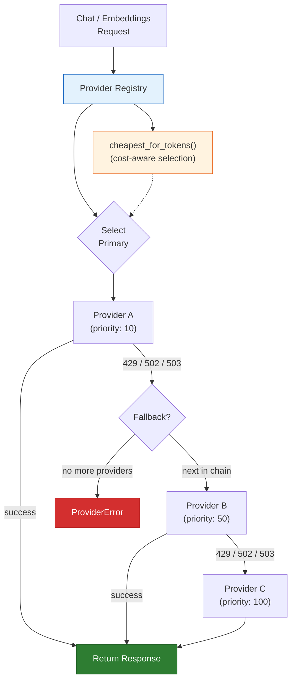

Priority-ordered fallback chain with automatic failover on retryable errors (429, 502, 503). Cost-per-token selection via `cheapest_for_tokens()` enables budget-aware routing across multiple upstream LLM providers. Routing decisions — provider name, attempts, and full fallback chain — are recorded in audit events for forensic analysis.

### Observability Stack

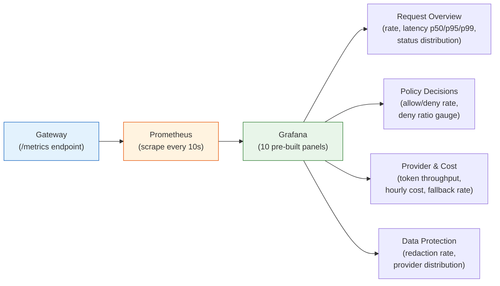

Custom in-process Prometheus collector with zero external dependencies — 6 counters and 1 histogram exposed at `/metrics` in standard text format. Pre-built Grafana dashboard ConfigMap with 10 panels across four operational domains, deployable alongside the gateway Helm chart.

### OpenAI API Compatibility

Drop-in compatible with OpenAI's chat completions, embeddings, and model listing endpoints. Application teams use standard OpenAI client SDKs without modification — governance is transparent at the transport layer.

## Security Trust Boundaries

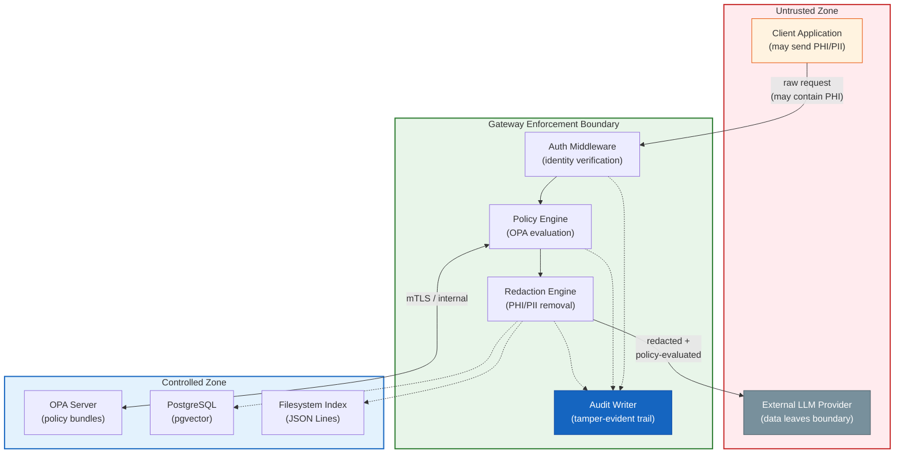

The gateway is the sole enforcement point between untrusted client traffic and untrusted provider egress. All governance — authentication, policy evaluation, data redaction, and evidence production — executes within this boundary. The controlled zone (OPA, PostgreSQL, filesystem index) is reachable only from the gateway over internal networking. No client traffic bypasses the enforcement layer, and no unredacted data leaves the boundary toward external providers.

## Key Architecture Decisions

| Decision | Alternative Considered | Trade-off | Why This Choice |
|---|---|---|---|
| Fail-closed on OPA unavailability | Fail-open with logging | Availability impact during policy outages | Explicit denial is safer than implicit permission in regulated workloads |
| Regex-first PHI/PII redaction | NER/ML model pipeline | Lower accuracy on context-dependent entities | Deterministic, no model dependency, measurable false-positive rate. ML upgrade path planned |
| Synchronous policy evaluation | Async / eventual consistency | Adds latency to every request | Async would break the "enforce before egress" guarantee |
| Single gateway binary | Microservice mesh | Cannot scale concerns independently | Reduces operational complexity; policy, redaction, and audit are tightly coupled |
| OpenAI-compatible surface only | Multi-protocol support | No native Anthropic/Google endpoints | Reduces scope; most providers offer OpenAI-compatible modes |
| Hash-based local embeddings | Always use remote embeddings | Lower semantic quality for retrieval | Deterministic, no network calls, enables air-gapped and test deployments |
| Custom Prometheus collector | `prometheus_client` library | More code to maintain | Zero external dependency; thread-safe in-process implementation with no transitive risk |

## Governance Modes

The gateway supports progressive adoption through two operational modes, allowing teams to validate policy behaviour against production traffic before enabling enforcement:

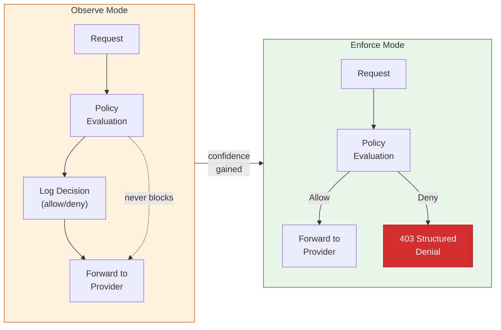

Teams start in observe mode to baseline policy decisions against real traffic patterns. Once false-positive rates are acceptable and policy coverage is validated, switching to enforce mode makes policy decisions binding.

## Tech Stack

| Layer | Technology |
|---|---|
| Language | Python 3.12+ |
| Framework | FastAPI 0.115+ (async, OpenAI-compatible) |
| Policy Engine | Open Policy Agent (OPA) 0.67+ |
| Vector Store | PostgreSQL 16+ with pgvector |
| Containerisation | Docker (Python 3.12-slim) |
| Orchestration | Kubernetes, Helm v3 |
| Observability | Prometheus metrics, Grafana dashboards, OpenTelemetry collector |
| CI/CD | GitHub Actions (test, deploy-smoke, release) |
| GitOps | Argo CD ApplicationSet, External Secrets Operator |
| Supply Chain | Cosign (keyless signing), SPDX SBOM, provenance attestation |
| Package Management | uv |
| Quality | pytest, ruff, mypy (strict mode) |

## Benchmark Methodology

The project follows a publish-methodology-not-just-scores approach to evaluation:

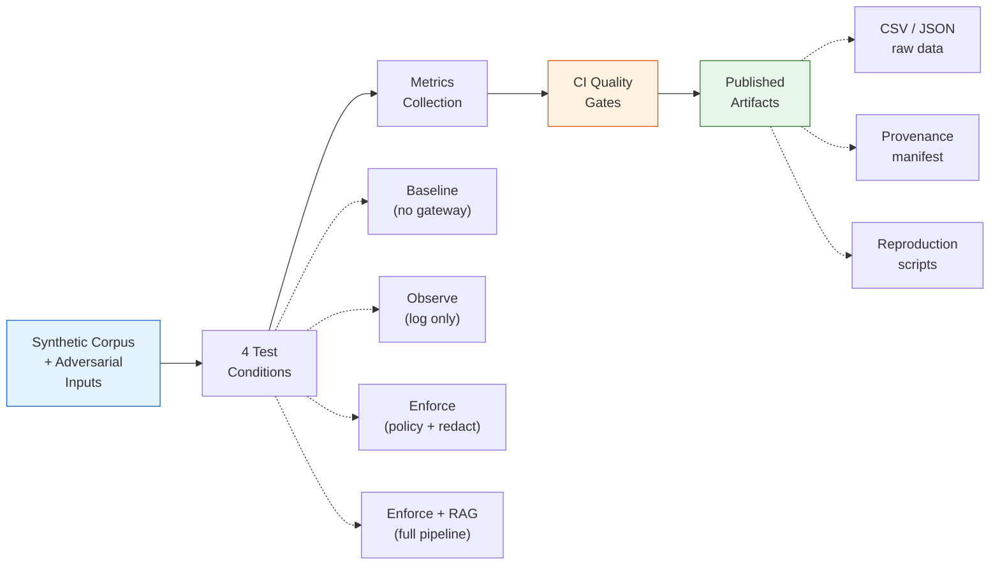

**Governance Yield vs Performance Overhead** — the primary benchmark track quantifies the tradeoff between governance effectiveness and runtime overhead:

| Condition | Description |
|---|---|
| Baseline | Direct provider calls, no gateway |
| Observe | Gateway decisions logged, not enforced |
| Enforce | Policy evaluation + data redaction |
| Enforce + RAG | Policy + redaction + connector-scoped retrieval |

**Key Metrics and v0.2 Targets:**
| Metric | Target |
|---|---|
| Leakage rate (sensitive data reaching provider) | < 0.5% |
| Redaction false-positive rate | < 8% |
| Policy deny F1 score | >= 0.90 |
| Citation integrity (authorised sources only) | >= 99% |
| p95 latency overhead (chat) | < 250 ms |
| p95 latency overhead (RAG) | < 600 ms |

CI-enforced quality gates: citation presence rate >= 0.95, pgvector Recall@3 >= 0.80. All benchmark artifacts (raw CSV/JSON, provenance manifests, reproduction scripts) are published alongside summary reports.

Full methodology: [`docs/benchmarks/governance-yield-vs-performance-overhead.md`](docs/benchmarks/governance-yield-vs-performance-overhead.md)

## Release and Supply Chain Pipeline

Every tagged release goes through a signed, auditable pipeline:

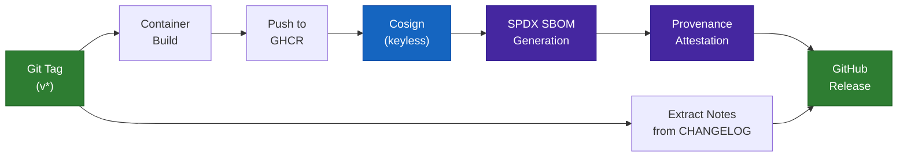

## CI/CD Pipeline

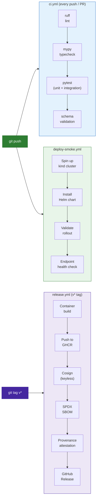

- **ci.yml** — lint (ruff), type check (mypy strict), test (pytest), and JSON Schema validation on every push and pull request
- **deploy-smoke.yml** — spins up a kind cluster, installs the Helm chart, validates rollout, and runs endpoint health checks
- **release.yml** — triggered by `v*` tags: builds container, pushes to GHCR, signs with cosign (keyless), generates SPDX SBOM, attaches provenance attestation, publishes release notes from CHANGELOG

## GitOps and Secret Management

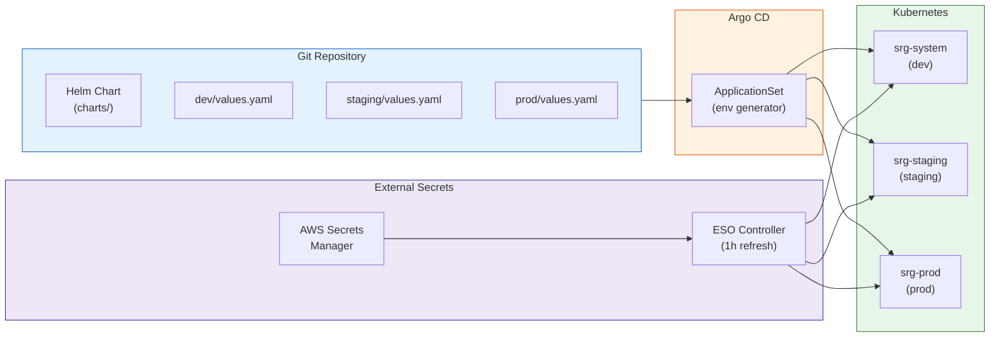

Argo CD ApplicationSet generates one Application per environment from a list generator. Dev and staging auto-sync on commit; prod requires manual sync approval. External Secrets Operator syncs API keys and provider credentials from AWS Secrets Manager into Kubernetes Secrets with automatic 1-hour refresh. Rotation runbook covers standard rotation, emergency revocation, and sync monitoring.

## Competitive Landscape

Evaluated against 10 adjacent tools in the AI gateway and governance space:

| Category | Tools Evaluated |
|---|---|
| AI Gateway / Proxy | LiteLLM Proxy, Portkey, OpenRouter |
| API Gateway + AI | Kong AI Gateway, Gloo AI Gateway, Envoy AI Gateway |
| Cloud-Native AI Gateway | Cloudflare AI Gateway, Azure APIM GenAI Gateway |
| Guardrails / Safety | NVIDIA NeMo Guardrails, Guardrails AI |

**Differentiation — three capabilities no single competitor combines:**

- **Fail-closed in-path policy enforcement** — deterministic deny when OPA is unavailable, not silent fallback to permissive behaviour
- **Tamper-evident decision lineage** — SHA-256 hash-chained audit events with policy version hashes, enabling forensic reconstruction of any request
- **Policy-scoped RAG with citation integrity** — retrieval authorization decoupled from prompt content, citations verified against allowed sources

Full analysis with source references: [`docs/strategy/differentiation-strategy.md`](docs/strategy/differentiation-strategy.md)

## Engineering Metrics

### Codebase Scale

| Metric | Value |
|---|---|
| Application code | ~2,354 lines across 34 modules |
| Test code | ~1,312 lines across 29 test files |
| Test-to-code ratio | 56% |
| Support scripts | ~1,118 lines across 8 scripts |
| Documentation | ~1,915 lines across 19 documents |
| Current version | 0.3.0-rc1 |

### Quality and Contracts

| Metric | Value |
|---|---|
| Type checking | mypy strict mode (zero errors) |
| Linting | ruff (zero warnings) |
| JSON Schema contracts | 3 (policy decision, audit event, citations) |
| Test coverage scope | Unit, integration, contract, benchmark validation |
| Benchmark eval gates | 2 (citation integrity, pgvector ranking) |

### Deployment and Operations

| Metric | Value |
|---|---|
| Kubernetes manifests | 25 YAML files |
| Helm chart templates | 12 templates with values schema validation |
| CI/CD pipelines | 3 (test, deploy-smoke on kind, signed release) |
| GitOps environments | 3 (dev, staging, prod via Argo CD) |
| Prometheus metrics | 6 counters + 1 histogram |
| Grafana dashboard panels | 10 panels across 4 operational domains |

## Quick Start

### Prerequisites
- Python 3.12+
- [uv](https://github.com/astral-sh/uv) package manager
- Docker (for containerised deployment)
- kind (for local Kubernetes)

### Development
```bash
make dev            # Start dev server with hot reload
make test           # Run full test suite
make lint           # Ruff linting
make typecheck      # mypy strict type checking
```

### Kubernetes Deployment
```bash
make helm-lint      # Validate Helm chart
make helm-template  # Generate manifests
make demo-up        # Deploy to kind + smoke test
```

### API Usage

PHI-classified request with automatic redaction:
```bash
curl -s http://127.0.0.1:8000/v1/chat/completions \
  -H 'Authorization: Bearer dev-key' \
  -H 'x-srg-tenant-id: tenant-a' \
  -H 'x-srg-user-id: user-1' \
  -H 'x-srg-classification: phi' \
  -H 'content-type: application/json' \
  -d '{"model":"gpt-4o-mini","messages":[{"role":"user","content":"hello DOB 01/01/1990"}]}'
```

RAG-enabled request with citation tracking:
```bash
curl -s http://127.0.0.1:8000/v1/chat/completions \
  -H 'Authorization: Bearer dev-key' \
  -H 'x-srg-tenant-id: tenant-a' \
  -H 'x-srg-user-id: user-1' \
  -H 'x-srg-classification: phi' \
  -H 'content-type: application/json' \
  -d '{
    "model":"gpt-4o-mini",
    "messages":[{"role":"user","content":"give triage policy summary"}],
    "rag":{"enabled":true,"connector":"filesystem","top_k":2}
  }'
```

Generate an evidence bundle for incident replay:
```bash
python scripts/audit_replay_bundle.py \
  --request-id <request_id> \
  --audit-log artifacts/audit/events.jsonl \
  --out-dir artifacts/evidence \
  --include-chain-verify
```

## Documentation

| Document | Description |
|---|---|
| [`docs/strategy/differentiation-strategy.md`](docs/strategy/differentiation-strategy.md) | Competitive analysis and positioning |
| [`docs/strategy/why-this-exists-security-sre.md`](docs/strategy/why-this-exists-security-sre.md) | Security and SRE problem narrative |
| [`docs/strategy/killer-demo-stories.md`](docs/strategy/killer-demo-stories.md) | 5 measurable demo scenarios |
| [`docs/benchmarks/governance-yield-vs-performance-overhead.md`](docs/benchmarks/governance-yield-vs-performance-overhead.md) | Full benchmark methodology |
| [`docs/architecture/threat-model.md`](docs/architecture/threat-model.md) | Threat matrix, controls, and residual risk |
| [`docs/operations/helm-kind-runbook.md`](docs/operations/helm-kind-runbook.md) | Local Kubernetes deployment guide |
| [`docs/operations/confluence-connector.md`](docs/operations/confluence-connector.md) | Confluence read-only connector setup |
| [`docs/operations/jira-connector.md`](docs/operations/jira-connector.md) | Jira read-only connector setup |
| [`docs/operations/compliance-control-mapping.md`](docs/operations/compliance-control-mapping.md) | Technical control-to-evidence mapping |
| [`docs/operations/incident-replay-runbook.md`](docs/operations/incident-replay-runbook.md) | Request-level replay and signed evidence procedure |
| [`docs/operations/secrets-rotation-runbook.md`](docs/operations/secrets-rotation-runbook.md) | Secret rotation and emergency revocation |
| [`docs/contracts/v1/`](docs/contracts/v1/) | JSON Schema contracts (policy, audit, citations, evidence bundle) |
| [`docs/releases/v0.2.0.md`](docs/releases/v0.2.0.md) | Current release notes |

## Honest Gap Assessment

This project makes narrow, testable claims — not aspirational ones:

- **No claim of perfect PHI detection.** Regex-first redaction has measurable false positives and false negatives. Rates are benchmarked and published.
- **No claim of full provider API parity.** OpenAI compatibility covers core endpoints (chat, embeddings, models). Provider-specific extensions are out of scope in early versions.
- **No claim that this replaces broader controls.** Gateway enforcement does not substitute for secure SDLC, IAM, or data governance programmes.
- **Policy quality depends on fixture coverage.** OPA policies can drift without strict test gates and review processes.

## Roadmap

- [x] Multi-provider routing with cost-aware fallback
- [x] Baseline Grafana dashboards for request/policy/cost telemetry
- [x] External secrets integration and rotation runbook
- [x] GitOps manifests (Argo CD) for declarative promotion
- [x] Streaming support for chat completions
- [x] Azure/Anthropic provider adapters
- [x] S3 connector for document retrieval
- [x] EKS reference deployment with validated guide
- [x] Evidence replay bundle export and schema
- [x] Confluence read-only connector
- [x] Jira read-only connector
- [x] Signed evidence bundle output (detached signature + verification)

## Licence

See [LICENSE](LICENSE) for details.
